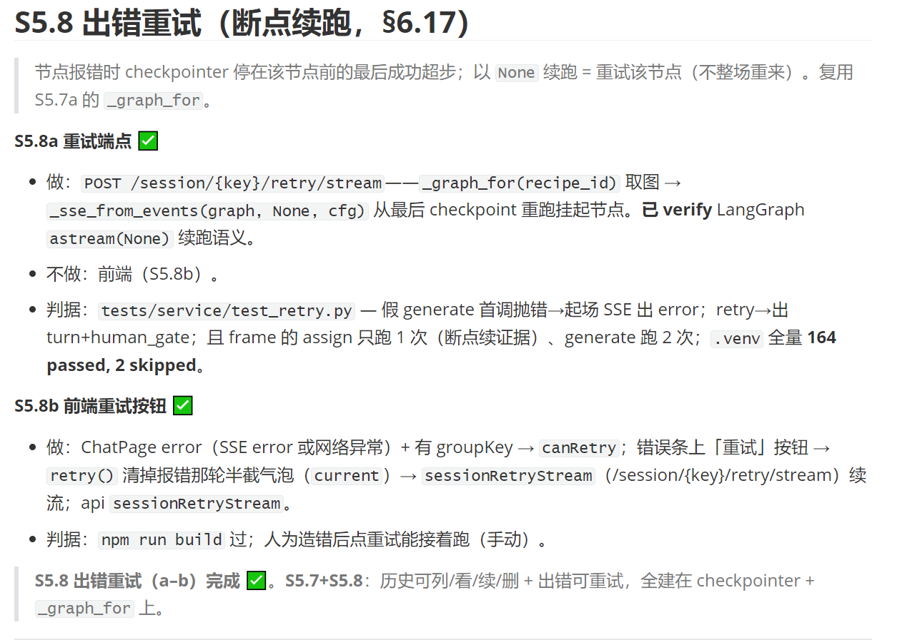
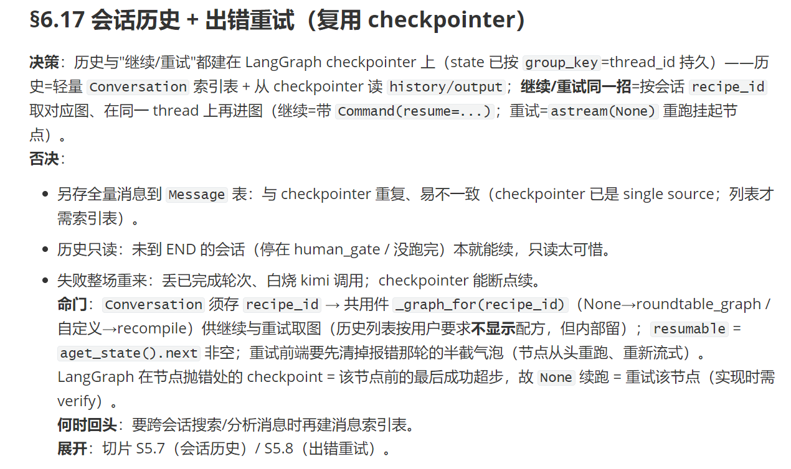
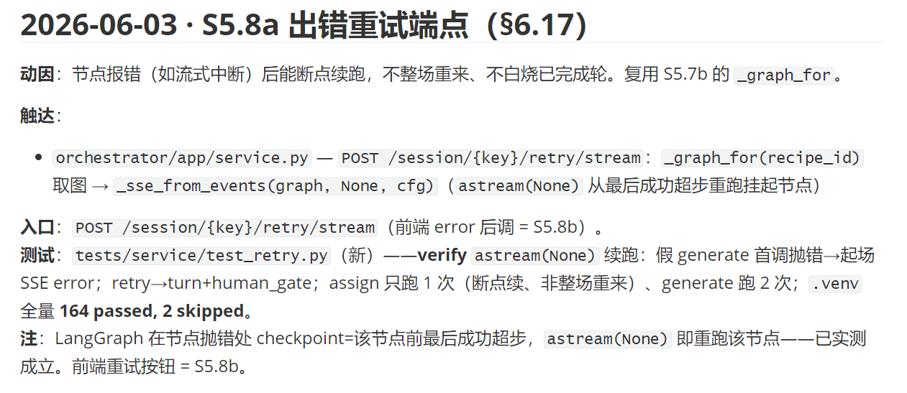

# Slice-Driven Dev

Slice-Driven Dev 是一个Code skill，让 AI 在帮你写代码时遵守一套工程纪律，使项目可验证、可追溯、可交接。

AI 写代码很快，但"快"本身不是问题——问题是一次动了太多地方、意图没说清楚就开始做、验证靠感觉而不是工具，出了事不知道从哪查。这个 skill 的核心做法是：**把每一段工作压缩成一个极小的"切片"**，每个切片在动手前声明它做什么、不做什么、怎么算完成，做完必须有测试、有文档条目、有 commit。切片是基本单位，不可再分，不可混搭——一刀一件事，刀刀留痕迹。

Claude的上下文对于一个大项目来说是一个问题，上下文过长会消耗很多token。该skill的解决办法就是以一个大切片为粒度进行对话的切换，使用SESSION_CHECKPOINT文档来热启动下一个对话，零摩擦成本。

---

## 它能帮你做什么

加载这个 skill 后，Claude 会在正确的时机自动触发对应的协议：

**意图不清楚先追问，不猜测。** 任务模糊时，Claude 每次只问一个最关键的问题，问到对意图有 ≥95% 把握才动手。不会先建一堆假设，做完再让你推倒重来。

**用极小的切片工作，每刀可验证。** 动手前先声明：这刀做什么、明确不做什么、怎么算完成。功能和重构不混在一起，"顺便"两个字出现就是切片污染。

**保持测试覆盖。** 改了已有路径就跑测试；加了新分支就写一条覆盖它的测试；修 bug 先写能复现的失败测试再修。没有测试框架时，Claude 会告诉你它手动验证了什么，而不是假装没问题。

**AI 生成输入，确定性工具判断输出。** Claude 出方案、写代码、列边界用例；编译器、测试 runner、linter 给出对错。"我看了一下感觉没问题"不算验证。

**文档是工作的副产品，不是尾声的总结。** 每个切片完成时同步产出三样东西：**代码链路条目**（文件:符号 → 改了什么）、**决策记录**（选了什么、否决了什么）、**架构更新**（模块边界变了才触发）。决策模板有硬约束——一句话 30 字以内，压不出来说明决策本身还没想清楚。

**大任务先拆切片再动手。** 涉及多文件、多步骤的任务，必须先分解成独立可提交的单元。每个单元只依赖文件状态，不依赖"我们刚才聊过的那个值"。

**会话切换前刷新热启动盘。** 大切片完成或会话即将结束时，Claude 会整页覆写 `SESSION_CHECKPOINT.md`：当前进度、下一步的原子动作、未提交的内容。下一个会话读这个文件，零摩擦接手。

---

## 适合谁

用 Claude Code 做有一定规模的工程工作的人——尤其是任务横跨多个会话、多个文件，或者有需要日后可追溯的决策时。

---

## 使用方法

把 `SKILL.md` 放到 Claude Code 的 skills 目录（`~/.claude/skills/software-engineering/`）。只要是写代码、重构、写技术文档的任务，skill 自动激活。说出以下关键词时触发对应协议：

| 说出... | 触发 |
|---|---|
| "重构" | 先确认测试全绿，再动结构 |
| "做个切片" / "做这一刀" | 声明范围、排除项、完成判据 |
| "拆任务" / 长的多步骤任务 | 分解成独立切片，用 TaskCreate 落盘 |
| "落档" / "写进文档" / "落进文档" | 决策模板（30 字规则强制执行） |
| "这个怎么验" / "怎么测" | AI 出用例，确定性工具给绿/红 |
| "刷新 checkpoint" / 会话结束前 | 整页覆写 SESSION_CHECKPOINT.md |

---

## 核心原则

切片是工作的基本单位。它有声明、有测试、有代码链路条目、有 commit。其他的都是噪音。

## 切片计划例子

## 决策文档例子

## 代码链路例子

